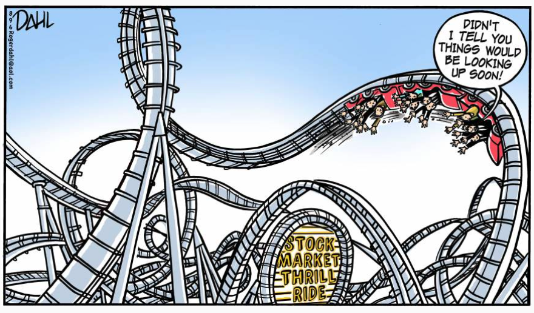
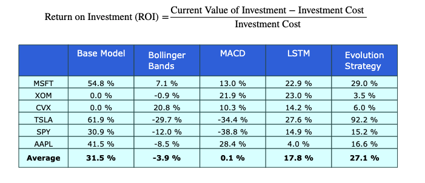

# Quantitative Trading Strategy
#### By: Ruby Han

## Abstract
Forecasting market movement is a long-time attractive topic. This project aims to evaluate different algorithmic strategies on Apple, Microsoft, ExxonMobil, Chevron, Tesla using S&P 500 index as the benchmark over a one-year period (2021). An agent framework was built to trigger buy or sell orders with an initial capital of $10,000 based on selected strategy. Return on investment (ROI) was used as the performance metric. Base model outperformed other strategies with ROI of 31.5\% but deep reinforcement learning model Evolution Strategy coming close in second place with ROI of 27.1\%. Success of each strategy varied wildly with each stock for the time period. Machine learning models fared better than technical indicator models.

## Problem Objective 
- Create a quantitative trading strategy for any stocks
- No restriction on number of times entering or exiting the market, or long/short for period of strategy
- Benchmark with S&P 500 index
- Elucidate results and conclusion
- Provide future work and considerations given more time and resources

## Models Built

**Base Model:**

- Buy and Hold: Invest initial capital on first day and hold until last trading day

**Technical Indicators:**

- Bollinger Bands: Momentum model using moving standard deviations as bands

- MACD: Moving average convergence divergence index

**Machine Learning Models**

- Evolution Strategy: Deep reinforcement learning model

- LSTM: Long short-term memory model

## Result Summary

**Performance Metrix:**

## Conclusion
- **Base model (buy and hold strategy)** on average performed the best with **average ROI of 31.5%**
- Technical indicators Bollinger Bands and MACD did very poorly
- Machine learning models fared better compared to technical indicators
- The stock market is a very volatile and complex system
- Historical data is not enough to explain its behavior

## Future Work
To improve our predictions, the below could be performed for future considerations:
- Continue refining the hyperparameters of current models
- Utilize other models such as ADX (Average Directional Movement Index) and other DRL models
- Fundamental analysis
- Sentiment analysis (twitter, news, social media etc.)
- Local/global economy analysis